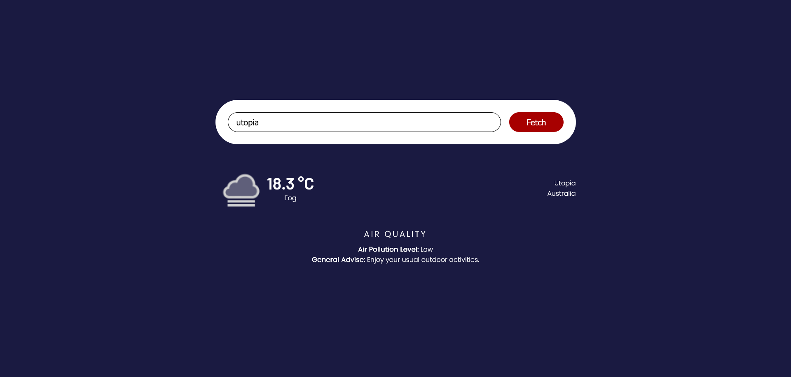

# weather-app

A weather app build using [weather api](https://www.weatherapi.com/). Build as a part of [odin project curriculum](https://www.theodinproject.com/lessons/node-path-javascript-weather-app).

### How it works? 
Enter location of which you want to see weather reports

[Live Preview](https://akanksha493.github.io/weather-app/)

### Resources
- [about aqi table](https://uk-air.defra.gov.uk/air-pollution/daqi)